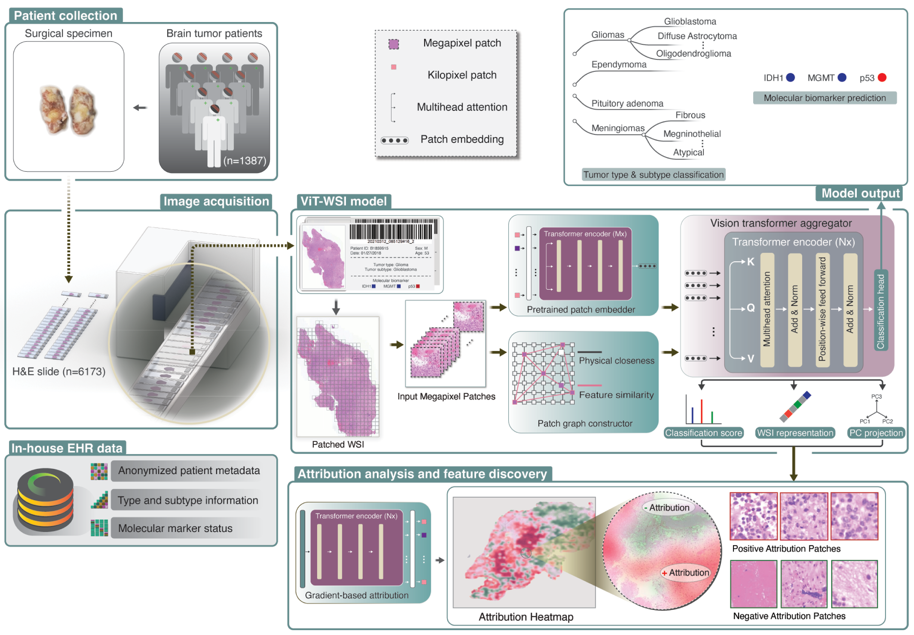

# ViT-WSI: Vision Transformer-based Weakly-Supervised Histopathological Image Analysis of Primary Brain Tumors 

## Overview
<div align="center">
  
</div>

This repository contains the code of ViT-WSI from

Li,Zhongxiao, et al. "Vision Transformer-based Weakly-Supervised Histopathological Image Analysis of Primary Brain Tumors".

## Prerequisites

### Dependencies
The code is tested with the following dependencies:
- Python related dependencies
  - python 3.9
  - cython 0.29.24
- Pytorch related dependencies
  - pytorch 1.8.2
  - torchvision 0.9.2
  - tensorboardX 2.4
  - einops 0.3.2
  - timm 0.4.12
- numpy 1.19.5
- scipy 1.7.1
- pandas 1.3.2
- pyTables 3.5.2
- h5py 3.1

### Conda environment
Modify the information of conda environment in `shell_scripts/setup_environment.sh` to let it be used in `meta-main.sh`.

## Dataset Preparation
An example glioma dataset containing 147 glioma slides from TCGA is available at `dataset_files/TCGA-glioma-subtyping/info/selected_slides-info.csv`.

Please download the corresponding slides (in svs format) from [The Cancer Genome Atlas (TCGA)](https://portal.gdc.cancer.gov/), and save them to `dataset_files/TCGA-glioma-subtyping/WSI`. 

In the following steps, the intermediate results will be saved to the subdirectories of `dataset_files/TCGA-glioma-subtyping`.
## Create Patches
To extract 1024×1024 patches from the slides:
```
bash meta-main.sh create_patches
```
The results will be saved to `dataset_files/TCGA-glioma-subtyping/patches`.
## Extract Features
To extract features using the feature extractor `ViT-L-16`:
```
bash meta-main.sh extract_feature 
```
The results will be saved to `dataset_files/TCGA-glioma-subtyping/features`.
## Create Patch Graph (for ViT-WSI + Graph, optional)
Compile the Cython extention:
```
python setup.py build_ext --inplace
```
Build graph that will be automatically saved to pickle files:
```
bash meta-main.sh build_slide_graph
```
The results will be saved to `dataset_files/TCGA-glioma-subtyping/slide_graph`.

## Create 10-fold Splits
```
bash meta-main.sh create_splits
```
The dataset will be randomly split into 10 folds. In each fold, #train:#test=8:2.

The results will be saved to `dataset_files/TCGA-glioma-subtyping/splits`.

## Training and Evaluation
To run the ViT-WSI aggregater training without slide graph, use `TCGA-glioma-subtyping-vit_aggr` as the experimental code. This uses `config_files/TCGA-glioma-subtyping-vit_aggr.yaml` as the configuration file.
```
bash meta-main.sh train_eval TCGA-glioma-subtyping-vit_aggr
```

To run the ViT-WSI aggregater training with slide graph, use `TCGA-glioma-subtyping-graph_vit_aggr` as the experimental code. This will use `config_files/TCGA-glioma-subtyping-graph_vit_aggr.yaml` as the configuration file.

```
bash meta-main.sh train_eval TCGA-glioma-subtyping-graph_vit_aggr
```
## Aggregate Evaluation Statistics
This aggregates the performance statistics across the folds. Depending the experiment that has been performed, either use
```
bash meta-main.sh eval_aggr TCGA-glioma-subtyping-vit_aggr
```
or
```
bash meta-main.sh eval_aggr TCGA-glioma-subtyping-graph_vit_aggr
```
The performance statistics will be saved to `dataset_files/TCGA-glioma-subtyping/train/TCGA-glioma-subtyping-graph_vit_aggr/fold_aggr`.
## Acknowledgements
The preprocessing part (patch creation, feature extraction, and dataset splitting) was developed based on the code of [CLAM](https://github.com/mahmoodlab/CLAM). We thank the original authors for making their code publicly accessible to the community.